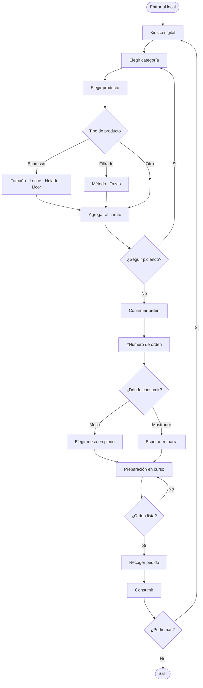

```mermaid
flowchart TD
    A([Entrar al local]) --> B[Kiosco digital]
    B --> C[Elegir categoría]
    C --> D[Elegir producto]

    D --> E{Tipo de producto}
    E -->|Espresso| F[Tamaño · Leche · Helado · Licor]
    E -->|Filtrado| G[Método · Tazas]
    E -->|Otro| H[ ]

    F & G & H --> I[Agregar al carrito]

    I --> J{¿Seguir pidiendo?}
    J -->|Sí| C
    J -->|No| K[Confirmar orden]

    K --> L[#Número de orden]

    L --> M{¿Dónde consumir?}
    M -->|Mesa| N[Elegir mesa en plano]
    M -->|Mostrador| O[Esperar en barra]

    N & O --> P[Preparación en curso]
    P --> Q{¿Orden lista?}
    Q -->|No| P
    Q -->|Sí| R[Recoger pedido]

    R --> S[Consumir]

    S --> T{¿Pedir más?}
    T -->|Sí| B
    T -->|No| U([Salir])

    style H fill:none,stroke:none,color:transparent
```
